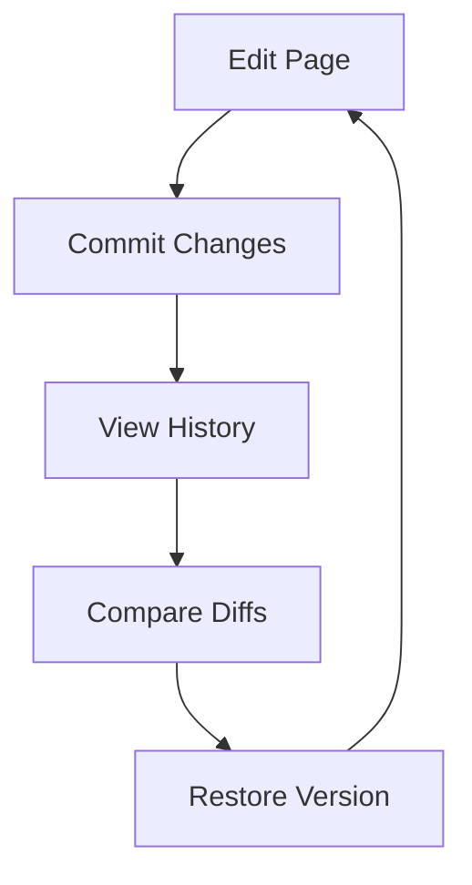

## Overview

Bhavin Ondhiya provides powerful tools to streamline your documentation workflow. You can structure documents hierarchically, organize projects efficiently, search content with advanced filters, and manage versions seamlessly. These core features help you maintain organized, searchable, and up-to-date documentation spaces.

<Columns cols={2}>
  <Card title="Document Structuring" icon="book-open" href="#document-structuring">
    Build nested hierarchies with pages and sections.
  </Card>
  <Card title="Project Organization" icon="folder" href="#project-organization">
    Group docs into projects with custom views.
  </Card>
  <Card title="Search and Filtering" icon="search" href="#search-filtering">
    Find content quickly across your entire space.
  </Card>
  <Card title="Version Control" icon="git-branch" href="#version-control">
    Track changes and revert with ease.
  </Card>
</Columns>

## Document Structuring

Create a clear hierarchy for your documentation using nested pages and frontmatter. You define structure with YAML frontmatter and MDX headings, enabling easy navigation.

<Steps>
  <Step title="Add Frontmatter" icon="file-text">
    Start every page with YAML to set metadata.

````mdx
---
title: My Page
description: Page summary here
---
````
  </Step>
  <Step title="Use Headings" icon="heading">
    Organize content with H2, H3, and H4 for hierarchy.

    ```mdx
    ## Main Section

    ### Subsection

    Content details here.
    ```
  </Step>
  <Step title="Link Pages" icon="link">
    Connect sections with internal links like `[Next Page](/features#project-organization)`.
  </Step>
</Steps>

<Callout kind="tip">
  Always start body content with H2 headings to maintain proper hierarchy without H1.
</Callout>

## Project Organization

Organize multiple documentation sets into projects. You assign pages to projects, customize sidebars, and switch views dynamically.

<Tabs>
  <Tab title="Folder View" icon="folder">
    View pages in a tree structure.

    ```
    docs/
    ├── introduction.mdx
    ├── features/
    │   └── organization.mdx
    └── api/
        └── endpoints.mdx
    ```
  </Tab>
  <Tab title="Tag View" icon="tag">
    Filter by tags for cross-project organization.

    <CodeGroup tabs="JavaScript,Python">
    ````javascript
    // Add tags in frontmatter
    ---
    tags: ["feature", "guide"]
    ---
    ````
    ````python
    # Use tags for filtering
    tags = ["feature", "guide"]
    ````
    </CodeGroup>
  </Tab>
</Tabs>

## Search and Filtering

Bhavin Ondhiya's search scans full-text across all projects. You apply filters by tags, dates, or types for precise results.

| Feature | Description | Example Filter |
|---------|-------------|----------------|
| Full-Text Search | Matches keywords in content | `authentication` |
| Tag Filter | Narrows by labels | `tags:api` |
| Date Range | Recent changes only | `updated:>2024-01-01` |
| Project Scope | Limit to one project | `project:docs-v2` |

<Callout kind="info">
  Use quotes for exact phrases like `"version control"`.
</Callout>

## Version Control Basics

Track changes to your docs with built-in version history. You commit changes, compare diffs, and restore previous versions.



<Expandable title="Advanced Version Workflow" default-open="false">
  For teams, enable branch previews.

  <Steps>
    <Step title="Create Branch">
      Branch from main for features.
    </Step>
    <Step title="Merge Changes">
      Pull request with review.
    </Step>
  </Steps>
</Expandable>

<Columns cols={3}>
  <Card title="Quickstart" icon="rocket" href="/quickstart">
    Get started in minutes.
  </Card>
  <Card title="Authentication" icon="lock" href="/authentication">
    Secure your space.
  </Card>
  <Card title="Changelog" icon="git-commit" href="/changelog">
    See latest updates.
  </Card>
</Columns>